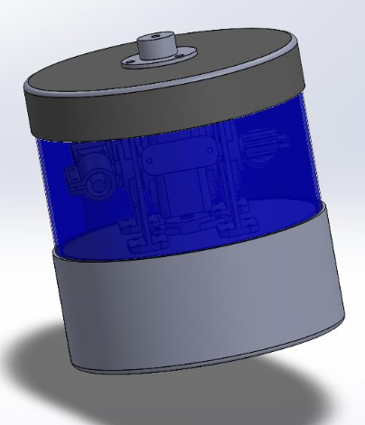
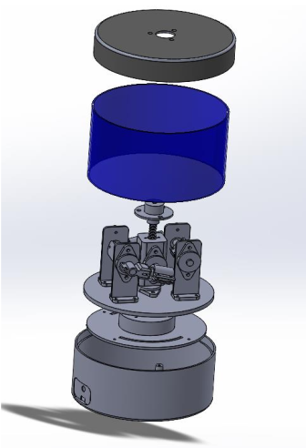
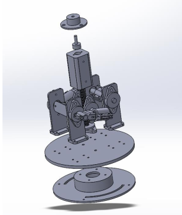
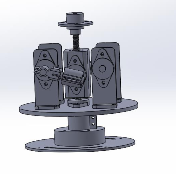
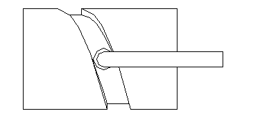
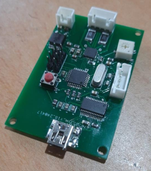

<div align="center">

# 3D LiDAR Scanner

**A cost-effective, single-motor 3D LiDAR scanner for generating high-resolution spiral point clouds.**

</div>

<div align="center">
  <table>
    <tr>
      <td align="center" style="padding: 10px;">
        <br>
        <em style="font-size: 0.9em;">The complete 3D LiDAR scanner assembly</em>
      </td>
      <td align="center" style="padding: 10px;">
        <br>
        <em style="font-size: 0.9em;">Exploded view showing internal components</em>
      </td>
    </tr>
  </table>
</div>


---

## 📖 Overview

This project presents a groundbreaking 3D LiDAR scanner designed to offer a cost-effective solution for generating high-resolution point clouds using a single laser module. Utilizing a TF Mini-S laser module, our scanner implements a distinctive cylindrical cam mechanism, which allows it to achieve both horizontal and vertical scanning movements with only one stepper motor. This innovative design produces a spiral-shaped point cloud, providing an affordable alternative to traditional industrial LiDAR systems, which are often expensive and complex. The system features a custom-designed PCB incorporating an AVR microcontroller and an A4988 motor controller, ensuring precise control over the stepper motor. Although the scanner operates at a slower speed compared to industrial counterparts, it significantly reduces costs and makes advanced 3D scanning accessible for students, researchers, and enthusiasts. Comprehensive documentation, including SolidWorks designs, PCB schematics, and source code, is provided to facilitate further development and customization. We are also planning to develop a software interface that will enable users to adjust scanning speed, resolution, and visualize the point clouds in real-time, enhancing the overall functionality and usability of the scanner.

## ✨ Key Features

- **Low-Cost Design**: Built with affordable and readily available components.
- **Single-Motor Operation**: An innovative cylindrical cam mechanism drives both horizontal and vertical motion with one stepper motor.
- **Spiral Scanning**: Generates a unique spiral point cloud to capture 3D data.
- **Custom PCB**: A dedicated PCB with an ATmega328P microcontroller for robust and reliable control.
- **Open Source**: All design files, schematics, and source code are provided for further development and customization.

## ⚙️ How It Works

The scanner's core is its innovative cylindrical cam mechanism. This is achieved by having the rotating LiDAR sensor assembly engage with a stationary, threaded cylinder. As the stepper motor rotates the main body horizontally, a cam follower on the LiDAR mount travels along the groove of this stationary cylinder. This action converts the horizontal rotation into a continuous vertical tilting motion of the LiDAR sensor. The combination of constant horizontal rotation and the induced vertical tilt results in a spiral scanning path, allowing the single laser module to capture a full 3D environment.

<div align="center">
  <table style="margin-top: 20px;">
    <tr>
      <td align="center" style="padding: 10px;">
        <br>
        <em style="font-size: 0.9em;">Exploded view of the internal mechanism</em>
      </td>
      <td align="center" style="padding: 10px;">
        <br>
        <em style="font-size: 0.9em;">Assembled internal view</em>
      </td>
      <td align="center" style="padding: 10px;">
        <br>
        <em style="font-size: 0.9em;">Cylindrical cam mechanism in action</em>
      </td>
    </tr>
  </table>
</div>

The ATmega328P microcontroller executes a control loop that:
1.  Manages the stepper motor's acceleration, constant velocity, and deceleration phases for smooth rotation.
2.  Reads distance data from the TF Mini-S LiDAR sensor via UART.
3.  Transmits the processed distance data to a computer for visualization and storage.


## 🛠️ Hardware

### Components
- **LiDAR Sensor**: TF Mini-S
- **Microcontroller**: ATmega328P
- **Motor Driver**: A4988 Stepper Motor Driver
- **Motor**: NEMA 17 Stepper Motor (or similar)
- **Serial Communication**: FT232RL USB to TTL Serial Adapter
- **Enclosure**: Designed by Solidworks.
- **Custom PCB**: See the `PCB/` directory for Altium files.

<div align="center" style="margin-top: 20px;">
    <br>
    <em style="font-size: 0.9em;">Custom-designed PCB for the LiDAR scanner</em>
</div>

## 📂 File Structure

```
├── Notes/              # Contains project notes, PDFs and images
├── PCB/                # Altium design files for the custom PCB
├── Solidworks/         # SolidWorks CAD files for the mechanical parts
└── src/
    └── main.c          # Main firmware for the ATmega328P
```

## 🚀 Future Development

We are planning to develop a software interface that will enable users to:
- Adjust scanning speed and resolution.
- Visualize the point cloud in real-time.
- Export the point cloud data in standard formats (e.g., .ply, .xyz).

## 🤝 Contributors

- Dineth Perera
- Seleka Deemantha

## 📄 License

This project is open-source. We encourage you to use, modify, and share it. Consider adding a license file to define the terms of use.
